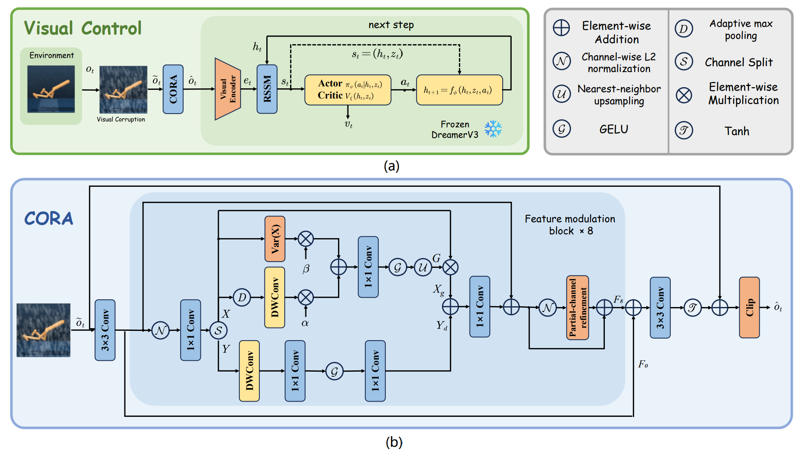
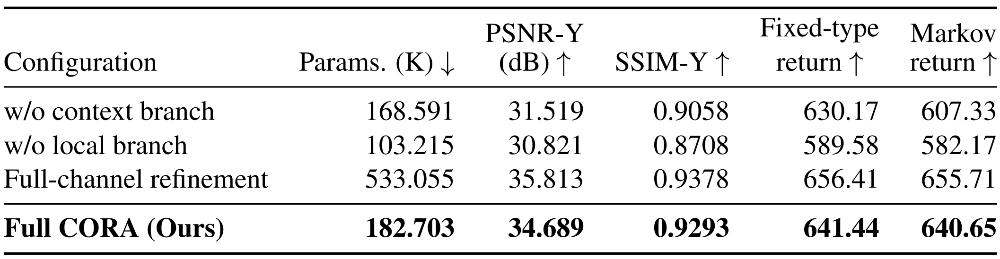

# CORA: Compact Observation Restoration for Robust Reinforcement Learning

CORA restores corrupted 64 × 64 RGB observations before a **frozen DreamerV3** policy. One 182,703-parameter adapter is shared across ten DeepMind Control Suite tasks and thirteen visual corruptions. The adapter is trained offline on clean–corrupted pairs with a spatial L1 and Fourier L1 loss.

The method figure and ablation table below use the two images supplied for this repository.

## Method



The diagram shows CORA in the frozen control loop and its contextual–local feature modulation block.

The model projects RGB into 36 channels, applies eight feature modulation blocks, and predicts a residual RGB correction. Each block combines pooled context, full-resolution local recovery, and partial-channel refinement. The corrected observation is clipped to `[-1, 1]` before the frozen encoder. The experiment code names this architecture `SMFARGB` or `smfa`. The implementation is in [`experiments/cora/aco-smfa-full13/models.py`](experiments/cora/aco-smfa-full13/models.py) and [`smfa_blocks.py`](experiments/cora/aco-smfa-full13/smfa_blocks.py).

## Experiment protocol

| Item | Project protocol |
| --- | --- |
| Tasks | Walker walk/run/stand, hopper stand, quadruped run, finger turn hard, cartpole swingup sparse, cup catch, reacher easy/hard |
| Observation | 64 × 64 RGB; frozen DreamerV3 policies |
| Data per task | 4,500 train, 500 validation, 1,000 test clean frames from disjoint episodes; paired with 13 corruption types |
| Corruptions | Rain, fog, snow, motion blur, Gaussian noise, low light, JPEG, defocus blur, frost, patch occlusion, reduced saturation, shadow, shot noise |
| Temporal modes | Fixed type; or Markov switching with 0.8 probability of retaining the current type |
| Optimization | 15,000 updates, effective batch 128, AdamW learning rate and weight decay `1e-4`, pixel L1 + `0.05 ×` real/imaginary FFT L1 |
| Control evaluation | 500 decisions per episode, action repeat 2; five episodes per task/type and ten per task for Markov switching |
| Comparators | Unadapted, ACO, PromptIR, NAFNet, and a separate DrQ-v2 agent |
| Diagnostics | Fixed clean recurrent history; posterior JS, next-state NRMSE, value NMAE, symmetric actor KL |

The project contains pilot runs, seed extensions, baseline comparisons, and ablations. Each run's README, config, and result files identify its scope. Single-seed results and multi-seed aggregates should be read separately. See [Experiment inventory](docs/EXPERIMENTS.md).

## CORA component ablation on reconstruction quality and episodic return



The ablation image summarizes reconstruction quality and episodic return. Some values in the image differ from the saved ablation report; see [Experiment inventory](docs/EXPERIMENTS.md).

## Repository layout

```text
assets/figures/cora-method.png           CORA method figure
assets/tables/cora-component-ablation.png CORA ablation table image
experiments/cora/aco-smfa-full13   Main thirteen-corruption seed-6 pipeline
experiments/cora/aco-smfa-full13-seed78
                                   Additional main-experiment seeds
experiments/cora/aco-smfa-markov*   Markov seed series
experiments/cora/dreamer-frame-full Fixed-history Dreamer diagnostics
experiments/cora/cora-ablation      Context/local/full-channel variants
experiments/cora/promptir-nafnet-*  Larger restoration baselines
experiments/cora/drqv2-walker       Separate DrQ-v2 controller
results/cora                       Downloaded reports and numeric outputs
docs/EXPERIMENTS.md               Run mapping and reproduction notes
```

Older pilot and auxiliary source directories are retained under `experiments/cora/` for provenance. Absolute paths in published configs use `/data1/CST/CORA` as a **path template**; set the data, checkpoint, policy, and output fields to the actual locations before running. Large generated datasets, trajectories, and model checkpoints are not stored in Git. Their roles and approximate sizes are documented in [Experiment inventory](docs/EXPERIMENTS.md).

## Run the main pipeline

Use a Linux GPU host with the project dependencies and frozen DreamerV3 policy checkpoints. From `experiments/cora/aco-smfa-full13`, update `config.json` to the local data and policy paths, then run:

```bash
python tests.py
python supervisor.py
```

The published environment path `/data1/CST/CORA/aco-smfa-pilot/env/bin/python` is a template. Use the actual Python environment to run `supervisor.py`, which manages generation, GPU training, image evaluation, CPU control evaluation, and reporting. Read the [main experiment README](experiments/cora/aco-smfa-full13/README.md) before rerunning. `run.py` exposes individual stages for inspection or recovery.

The other experiment directories each contain their own README and launch script. The source snapshot reflects the server state; its absolute paths and third-party dependencies have not been replaced with a new one-command installer. Reproduction requires the corresponding frozen policy files and clean-frame data.

## Provenance and results

This repository was assembled from source and experiment outputs on the supplied server. Numeric results were copied without rerunning experiments; personal path labels in text files were normalized for the project. See [Experiment inventory](docs/EXPERIMENTS.md) for result scope and artifact boundaries.
